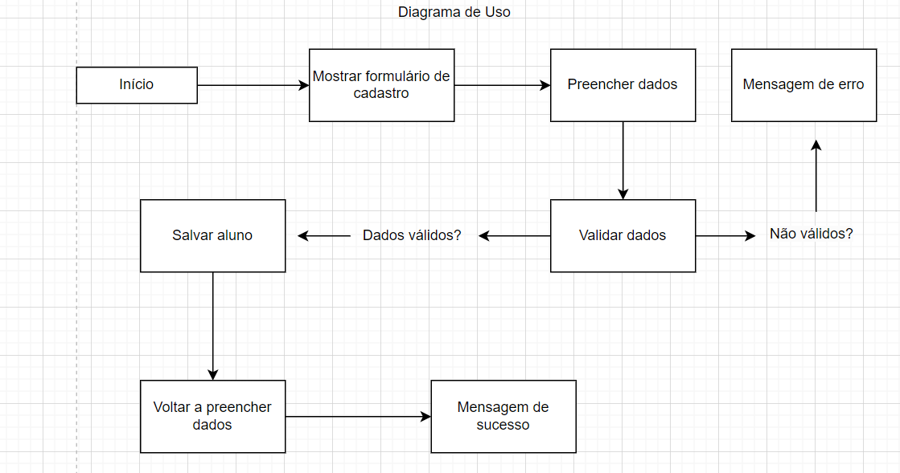
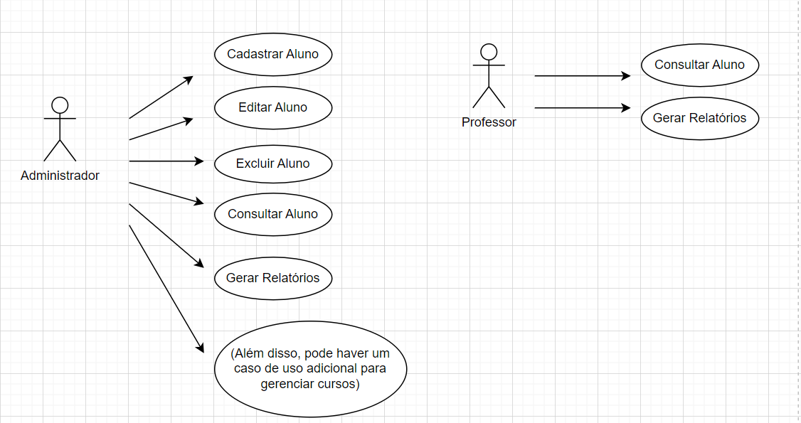
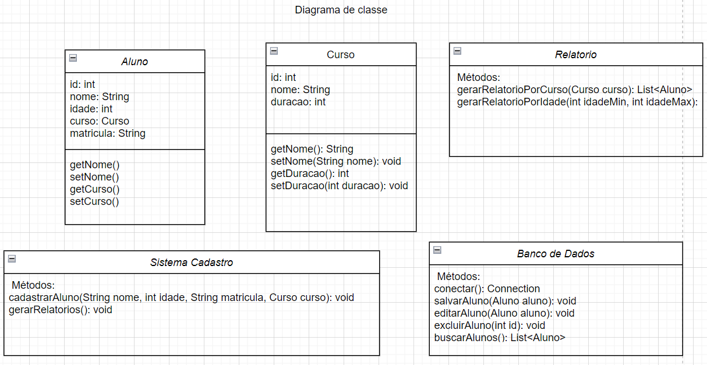

# Sistema de Cadastro de Alunos

## Contexto do Projeto
O Sistema de Cadastro de Alunos é uma aplicação voltada para a gestão eficiente de informações de alunos em instituições de ensino. O projeto visa facilitar o cadastro, gerenciamento e consulta de dados dos alunos, permitindo que administradores e professores realizem operações de forma rápida e intuitiva. Utilizaremos Java com a biblioteca Swing para a interface gráfica e PostgreSQL para a persistência de dados.

## Escopo do Projeto
Desenvolver um sistema de cadastro de alunos que permita o gerenciamento das informações dos alunos, incluindo funcionalidades para registro, edição, exclusão e consulta de dados. O sistema terá uma interface amigável e será projetado para atender as necessidades tanto de administradores quanto de professores, garantindo eficiência e organização.

## Objetivos Gerais
- Criar uma aplicação que permita o cadastro e gerenciamento de informações de alunos.
- Integrar tecnologias que garantam a performance e a segurança da aplicação.
- Proporcionar uma interface de usuário intuitiva e acessível.

## Objetivos Específicos
- Implementar um sistema de cadastro de alunos com informações como nome, idade, curso e matrícula.
- Permitir que administradores e professores acessem e atualizem os dados dos alunos.
- Oferecer relatórios de desempenho e status dos alunos.
- Garantir a segurança das informações por meio de autenticação.

## Objetivos Mensuráveis
- **Meta de Usuários**: Alcançar 500 alunos cadastrados no sistema nos primeiros 3 meses.
- **Meta de Funcionalidade**: Implementar todas as funcionalidades principais no prazo de 4 meses.
- **Taxa de Erros**: Garantir que a taxa de erros do sistema não ultrapasse 2% durante os testes.

## Objetivos Atingíveis
- Utilizar tecnologias de fácil integração e suporte, como Java e PostgreSQL.
- Aplicar metodologias ágeis para facilitar a implementação e o desenvolvimento contínuo.
- Focar em uma interface de usuário simples, com treinamento mínimo para novos usuários.

## Objetivos Relevantes
- Oferecer uma solução que atenda às demandas atuais de instituições de ensino em relação ao gerenciamento de dados.
- Melhorar a eficiência no cadastro e consulta de alunos, facilitando o trabalho de administradores e professores.
- Proporcionar um sistema seguro e confiável para a gestão de informações sensíveis.

## Objetivos Temporais
### Fase 1 (Mês 1):
- Definição do escopo detalhado e levantamento de requisitos.
- Criação do banco de dados no PostgreSQL.
- Desenvolvimento inicial do backend e configuração do ambiente.

### Fase 2 (Mês 2):
- Implementação das principais funcionalidades: cadastro, edição e exclusão de alunos.
- Criação da interface gráfica utilizando Swing.
- Início dos testes unitários.

### Fase 3 (Mês 3):
- Implementação de funcionalidades de relatórios e consultas.
- Testes finais e ajustes baseados no feedback.
- Preparação para a entrega final e documentação do sistema.

## Análise de Riscos
### Problemas Potenciais e Soluções
1. **Baixa Adoção Inicial**
   - **Impacto**: Dificuldade em atrair usuários para o sistema.
   - **Soluções**: Campanhas de divulgação e treinamento para usuários.

2. **Sobrecarga do Banco de Dados**
   - **Impacto**: Possíveis lentidões no sistema com o aumento de dados.
   - **Soluções**: Otimização de consultas e uso de índices.

3. **Vulnerabilidades de Segurança**
   - **Impacto**: Risco de acesso não autorizado aos dados dos alunos.
   - **Soluções**: Implementação de autenticação robusta e criptografia de dados sensíveis.

4. **Bugs e Problemas Técnicos**
   - **Impacto**: Erros que podem comprometer a experiência do usuário.
   - **Soluções**: Adoção de testes rigorosos e feedback constante dos usuários.

## Recursos Tecnológicos
- **Linguagem de Programação**: Java
- **Biblioteca de Interface Gráfica**: Swing
- **Banco de Dados**: PostgreSQL
- **Ambiente de Desenvolvimento**: Visual Studio Code
- **Ferramentas de Controle de Versão**: Git

## Recursos Humanos
- **Desenvolvedor Backend**: Responsável pela lógica de negócio e integração com o banco de dados.
- **Desenvolvedor Frontend**: Responsável pela criação da interface gráfica e experiência do usuário.
- **Analista de Sistemas**: Responsável pela coleta de requisitos e definição do escopo.
- **Tester**: Responsável por realizar testes e garantir a qualidade do sistema.
- **Gerente de Projeto**: Responsável pela coordenação da equipe e cumprimento dos prazos.

**Diagrama de Fluxo**

**Diagrama de Uso**

**Diagrama de Classes**

